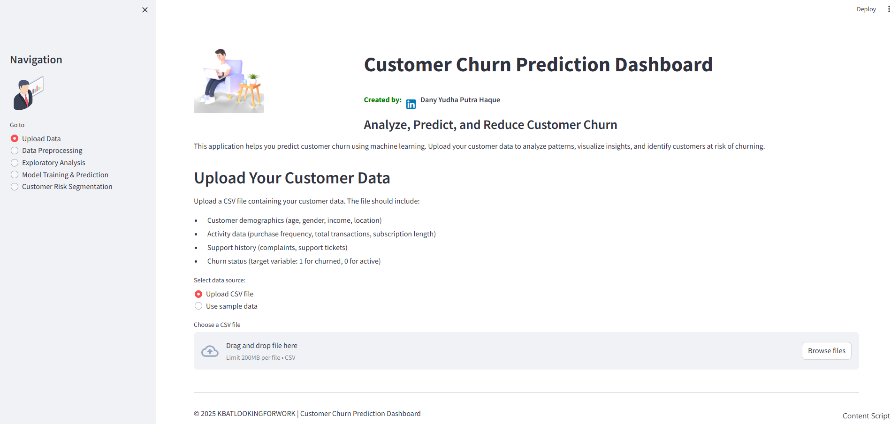

# Customer Churn Prediction Dashboard


This application implements a data-driven framework for customer churn prediction and analysis using machine learning approaches. The dashboard helps businesses identify, analyze, and predict customer churn patterns to implement effective retention strategies.

## Features

- **Data Upload & Processing**: Handles CSV files with customer data and provides preprocessing options
- **Exploratory Analysis**: Visualizes data distributions and correlations
- **Model Training**: Implements multiple ML models for churn prediction
- **Customer Risk Segmentation**: Analyzes customer journey and identifies high-risk segments

## Project Structure

```
├── assets/
│   ├── business-presentation.svg    # UI assets
│   └── businessman-working-on-laptop.png
├── sample_data/
│   └── customer_churn_data.csv     # Sample dataset
├── app.py                          # Main Streamlit application
├── data_preprocessing.py           # Data preprocessing module
├── exploratory_analysis.py         # Data analysis module
├── model_training.py              # ML model training
├── visualization.py               # Visualization functions
└── utils.py                       # Helper utilities
```

## Key Components

1. **Data Preprocessing**
   - Missing value handling
   - Categorical encoding
   - Numerical scaling
   - Feature selection

2. **Exploratory Analysis**
   - Data distribution visualization
   - Correlation analysis
   - Feature importance analysis
   - Churn patterns exploration

3. **Model Training**
   - Multiple model options
   - Performance metrics
   - Feature importance
   - Cross-validation

4. **Risk Segmentation**
   - Customer journey analysis
   - Risk level classification
   - High-risk customer identification
   - Retention recommendations

## Usage

The application runs on Streamlit and provides an interactive interface for:
- Uploading customer data (CSV)
- Data preprocessing configuration
- Model selection and training
- Visualization and analysis
- Downloading results and reports

## Detailed Methodologies

### 1. Data Preprocessing
Implements comprehensive data preparation:

#### Missing Value Handling
- Mean/Median imputation for numerical
- Mode imputation for categorical
- Optional row deletion

#### Feature Engineering
- Categorical encoding (One-hot, Label)
- Numerical scaling (Standard, MinMax)
- Custom feature creation

### 2. Model Training
Supports multiple ML algorithms:

#### Available Models
- Random Forest
- XGBoost
- Logistic Regression

#### Performance Metrics
```python
Accuracy = Correct Predictions / Total Predictions
Precision = True Positives / (True Positives + False Positives)
Recall = True Positives / (True Positives + False Negatives)
F1 Score = 2 × (Precision × Recall) / (Precision + Recall)
```

### 3. Customer Segmentation
Risk-based customer segmentation:

#### Journey Stages
- New (0-6 months)
- Early (6-12 months)
- Developing (1-2 years)
- Established (2-3 years)
- Loyal (3+ years)

#### Risk Categories
- Low Risk: Churn probability < 0.3
- Medium Risk: Churn probability 0.3-0.7
- High Risk: Churn probability > 0.7

### 4. Analysis Metrics
Comprehensive metrics calculation:

#### Customer Metrics
- Total Charges = Monthly Charges × Tenure
- Purchase Frequency = Transactions / Tenure
- Support Ratio = Support Tickets / Tenure

#### Risk Metrics
- Churn Probability
- Risk Score
- Customer Lifetime Value

## Installation

```bash
pip install -r requirements.txt
streamlit run app.py --server.port 5000
```

The application will be available at `http://0.0.0.0:5000`

## Data Format Requirements

Required CSV format:
- Must include 'Churn' column (1 for churned, 0 for active)
- Customer demographic features
- Usage/activity features
- Support/service features

## References

[1] Documentation available in the code comments and application interface.
